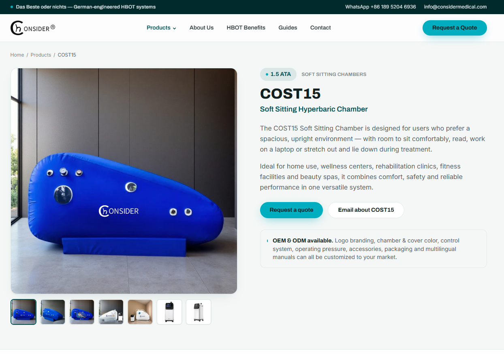
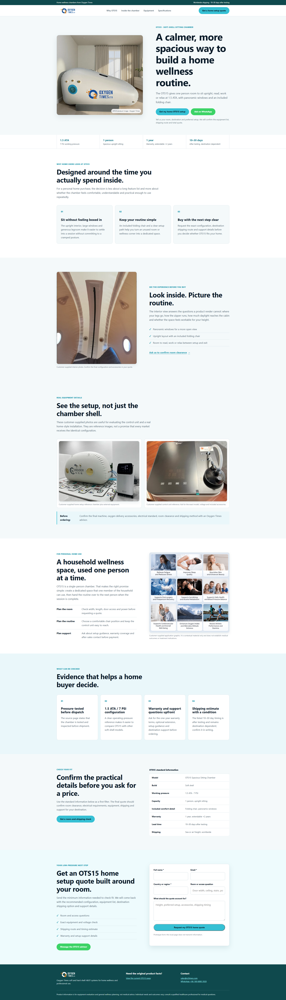
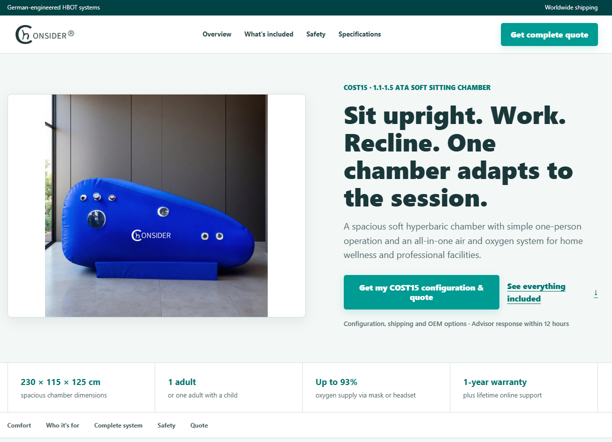

# 钩子，一款帮你提高页面转化的skill

这是我的第一个 GitHub 项目：一个用于优化集合页、广告着陆页、产品页和询盘页的 Codex skill。

钩子的核心目标不是单纯“把页面做得更漂亮”，而是把页面整理成一条更清晰的说服路径：先匹配用户意图，再展示价值和证据，最后用低压力、高价值的 CTA 推动用户行动。

## 这个 Skill 能做什么

- **AIDA 页面递进**：重排 Attention、Interest、Desire、Action，让用户从理解产品逐步走向咨询或购买。
- **钩子与标题优化**：用 4U 原则检查标题、利益点和行动钩子，让 CTA 说明用户能获得什么。
- **价值与卖点翻译**：把功能、参数和配件转化为使用场景、用户结果和采购价值。
- **信任证据排序**：优先使用真实产品图、规格、流程、质检、交付、售后和可验证的证据，不编造案例或数据。
- **CTA 与表单优化**：应用希克定律、费茨定律和表单减负规则，减少同级选项、无效字段和行动阻力。
- **品牌组件一致性**：复用原站 Logo、按钮 class、颜色、圆角、字重和交互状态；页面布局和信息结构仍可以重新设计。
- **响应式与可读性检查**：同时考虑桌面端和移动端，检查文字溢出、控件重叠、触控尺寸和视觉层级。
- **可验证的测试计划**：把页面阶段和跳出率、CTA 点击、表单完成、询盘质量等指标对应起来，不虚构提升百分比。

## 使用方式

### 在 Codex 中安装

在 Codex 新建对话，发送：

```text
安装这个 GitHub skill：
https://github.com/phovxe/gouzi-skill/tree/main/gouzi
```

安装完成后，在新对话中使用：

```text
$gouzi 审计并优化这个 landing page：<你的页面 URL>
```

也可以提供截图、设计稿或现有前端代码：

```text
$gouzi 根据这组截图，找出页面的转化阻力并给出优化版本。
```

当然还可以补充你的素材、人群来优化页面核心主题：

```text
$gouzi 我的目标人群是欧美45+女性群体，针对当前页面<你的页面 URL>，我的补充素材是<图片1><图片2><图片3>。
```
### 手动安装

将 `gouzi` 文件夹复制到 Codex 的 skills 目录：

```text
Windows: C:\Users\你的用户名\.codex\skills\gouzi\
macOS/Linux: ~/.codex/skills/gouzi/
```

最终应当能看到：

```text
gouzi/
├── SKILL.md
├── agents/
│   └── openai.yaml
└── references/
    ├── laws-and-rules.md
    ├── copywriting-frameworks.md
    └── visual-brand-and-buttons.md
```

## 使用效果示例

下面三张图用于说明同一个 COST15 产品页在不同优化方向下的视觉和信息层级变化。这里展示的是结构与体验差异，不代表已经测得实际转化率提升；真实效果需要结合流量来源、设备和业务数据验证。

### 1. 原图：产品详情页



原页面具备完整的产品图片、规格和询价入口，但首屏主要围绕型号和功能展开，两个行动按钮权重接近，用户需要自行判断下一步应该做什么。

### 2. 优化 A：强钩子营销型首屏



优化 A 将“Sit upright. Work. Recline.”作为第一视觉信息，配合大图、单一主 CTA 和首屏参数带，重点强化：

- 第一眼理解产品差异。
- 用利益点而不是型号作为首屏入口。
- 用“配置与报价”降低咨询门槛。
- 用规格带快速建立 Interest。

### 3. 优化 B：品牌一致的产品详情型首屏



优化 B 保留原站 Logo 和按钮风格，同时重新设计页面布局：左侧产品图，右侧利益点、说明和主 CTA。它更适合重视品牌连续性、B2B 采购信任和产品详情阅读的页面。

## 两种优化方向的区别

| 版本 | 主要策略 | 更适合关注的指标 |
| --- | --- | --- |
| 原图 | 完整展示产品信息 | 基准跳出率、滚动深度、原始 CTA 点击率 |
| 优化 A | 强钩子、强视觉、单一行动 | 首屏参与率、首屏 CTA 点击率、滚动继续率 |
| 优化 B | 品牌一致、信息清晰、B2B 产品详情 | 证据区到达率、表单启动率、合格询盘率 |


## 项目结构

```text
gouzi-skill/
├── README.md
├── screenshots/
│   ├── 1-original.png
│   ├── 2-optimized-a.png
│   └── 3-optimized-b.png
└── gouzi/
    ├── SKILL.md
    ├── agents/openai.yaml
    └── references/
```

欢迎通过 Issue 提出使用反馈或新的页面优化案例。
